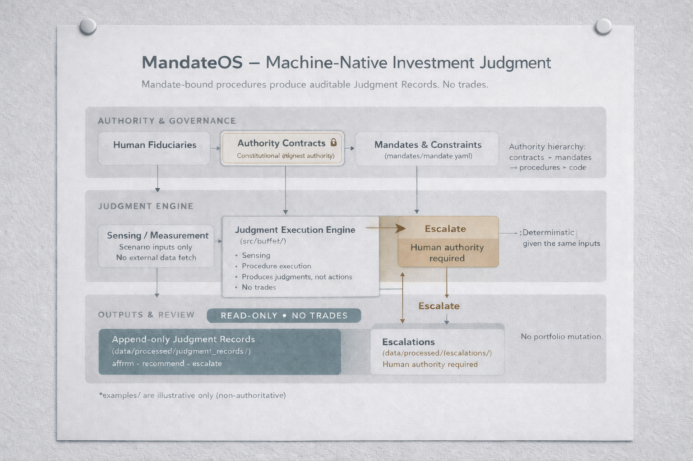

<p align="left" style="margin-bottom: 1.25rem;">
  
</p>

<p align="left">
  <sub>
    Institutional investment judgment as a governed control system.
  </sub>
</p>


# MandateOS — A Machine-Native Investment Judgment Framework

**Machine-native investment judgment with explicit authority boundaries.**

MandateOS is a concept implementation of **institutional investment judgment as governed procedure**: mandate-bound decision loops that produce append-only, reviewable **Judgment Records** (`affirm_alignment` / `recommend_adjustment` / `escalate`) and **halt automation via escalation** when authority boundaries are exceeded.

> **TL;DR:** IPS operationalization via governed procedures — **no trades**.  
> Deterministic scenarios in, **append-only** Judgment Records out.  
> When mandate/authority limits or ambiguity are hit: **escalation** (humans decide).  
> The deliverable is an auditable judgment trail, not execution.

## Recruiting Context

This repo is a **concept demo / pitch artifact** that intentionally prioritizes clarity of governance patterns over performance optimization, scale, or UI polish.

It should also read as relevant to any team building **governance-first investment judgment infrastructure** for **regulated institutional workflows** (CIO/CTO/ML leads), where authority boundaries and auditability are product requirements.

Why (in 30 seconds):
- Foundation-model reasoning is **not sufficient** for an investing system that must be governed.
- What scales institutionally is **procedure + mandate constraints + auditability**, not “smart outputs.”
- The core artifact is a **judgment record** that can be reviewed, reproduced, and audited — not a trade.

### What this is (and is not)
- **It is not a trading system.**
- **It is not an alpha engine.**
- **It is not a predictive model.**

Think of MandateOS like an aircraft autopilot for *governance*: it executes approved procedures **within explicit, enforceable authority boundaries**, while human fiduciaries monitor the instruments and take control when escalation requires judgment — **not execution**.

MandateOS is designed to make **Investment Policy Statements (IPS)** operational by encoding judgment as supervised, constraint-aware procedures whose outcomes are recorded, reviewable, and accountable.

---

## One-Minute Explanation
- **Inputs:** deterministic scenario measurements (`judgment_loops/*/scenarios/*.yaml`) — no live market data fetch.
- **Authority:** humans define constitutional “Authority Contracts” (`documentation/`).
- **Constraints:** mandates encode IPS-style thresholds and limits (`mandates/`).
- **Procedures:** judgment loops apply governed decision logic under a mandate (`judgment_loops/`).
- **Outputs:** append-only **Judgment Records** under `data/processed/` (auditable artifacts).
- **Safety valve:** when authority is exceeded or ambiguity is material → **`escalate`** (human authority required).
- **Learning mode:** improvements happen via **versioned mandate/procedure updates**, not trial-and-error with capital.

---

## Concrete Example (60 seconds)
- A DB pension / LDI mandate encodes a liquidity buffer + leverage limit in `mandates/.../mandate.yaml`.
- A “rising rates” stress is represented as deterministic sensing input: `judgment_loops/rate_regime_adjustment/scenarios/rising_rates.yaml`.
- A governed procedure in `judgment_loops/rate_regime_adjustment/...` defines triggers, allowed outcomes, and escalation rules.
- The engine runs the procedure under the mandate and produces a short rationale + confidence (deterministic, reviewable).
- If constraints are satisfied, the record can be `affirm_alignment`; if adjustments are warranted, `recommend_adjustment`.
- If authority is exceeded (e.g., leverage/liquidity breach) or uncertainty is material, the outcome is `escalate`.
- The output is written as an **append-only** artifact under `data/processed/` for audit/review.
- No portfolio mutation. Human authority required.

---

## What You Can Click Right Now
- **Judgment Viewer (GitHub Pages):** https://colinalexander.github.io/buffet/
- **Founder demo (narrative walkthrough):** `documentation/FOUNDER_DEMO.md`


<p align="left">
  <sub>
    Authority is explicit. Mandates bind judgment. Outputs are read-only records. Escalation halts automation when human authority is required.
  </sub>
</p>

---

## Why This Matters for a Foundation Model for Investing
If foundation models can reason, the problem is whether a system can **apply institutional investment judgment consistently** under explicit constraints — and remain **auditable** when things go wrong.

In real investing systems:
- **Reasoning ≠ governance.** Someone must define what the system is allowed to do.
- **Judgment must be reproducible.** “Same inputs → same outcome” is required for trust.
- **Outputs must be reviewable.** Institutions need an audit trail of what was decided and why.
- **Autonomy must stop at a boundary.** When uncertainty or authority limits are hit, the system must escalate.

MandateOS is a concrete sketch of that missing layer: **governance-first procedure** where “intelligence” is constrained by mandate-bound judgment, and the primary artifact is an **append-only judgment record — not a trade**.

---

## Core Design Principles
- **No trades / no portfolio mutation / read-only outputs.**
- **Explicit authority hierarchy:** contracts > mandates > procedures > code.
- **Deterministic sensing:** scenario inputs only; no external data fetch.
- **Append-only audit trail:** every run writes immutable artifacts under `data/processed/`.
- **Scenario-based regression tests:** prevent procedural drift when behavior flips unexpectedly.

---

## Candidate Fit
This repo demonstrates the instincts needed to build durable investing systems:
- **Governed ML systems:** authority boundaries, escalation, and invariants over “model cleverness.”
- **Reproducibility-first engineering:** deterministic inputs and append-only artifacts.
- **Evaluation harness mindset:** scenario-based regression tests for institutional intent.
- **Platform thinking:** clear separation of concerns and stable interfaces between documents, constraints, and code.

---

## Repo Map
- **Authority (canonical docs):** `documentation/*`
- **Constraints (mandates):** `mandates/*`
- **Procedures (judgment loops):** `judgment_loops/*`
- **Examples (non-authoritative):** `examples/*`
- **Outputs (append-only records):** `data/processed/*`
- **Code (execution, sensing, reasoning):** `src/buffet/*`

---

## Walkthrough (2 minutes)
1. Open the **Judgment Viewer**: https://colinalexander.github.io/buffet/
2. Pick a record and note the outcome: `affirm_alignment` / `recommend_adjustment` / `escalate`.
3. Open the referenced **mandate** (`mandates/.../mandate.yaml`) and inspect the binding constraints.
4. Open the referenced **procedure** (`judgment_loops/...`) and inspect decision logic + escalation rules.
5. Verify the record is **append-only** under `data/processed/` (immutable audit trail).

---

## Implementation Notes

### How It Works

#### Authority (`documentation/`)

Constitutional contracts that define what the system is allowed to do, what qualifies as a valid procedure, and what a valid output record must contain. These documents are the top of the hierarchy and intentionally override code when there’s ambiguity. If a lower-level artifact conflicts, the correct outcome is escalation—not reinterpretation.

#### Mandates (`mandates/`)

Authoritative constraints and thresholds per mandate (e.g., confidence floors, leverage limits, liquidity buffers). Mandates are machine-readable YAML plus supporting IPS text, and they define the boundaries of permitted judgment. Divergence across mandates is a feature: the same procedure can yield different outcomes because constraints differ.

#### Procedures (`judgment_loops/`)

Binding judgment logic specifications (markdown + trigger thresholds). Procedures encode how judgment is applied under a mandate, including permitted outcomes and escalation rules. Procedures may define trigger mechanics (e.g., persistence windows) but must not duplicate mandate limits.

#### Sensing (`src/buffet/sensing/`)

Deterministic measurement only (scenario inputs in YAML). No market data feeds. No adaptive data pipelines. No “models that move the goalposts.” The sensing layer produces a minimal state snapshot used by the procedure.

#### Reasoning (`src/buffet/reasoning/`)

Minimal deterministic logic to compute alignment, confidence, and short rationales. This layer is intentionally “boring”: it exists to make reasoning auditable and repeatable rather than clever. If uncertainty exceeds authority, it drives escalation rather than discretion.

#### Execution + Memory (`src/buffet/execution/`, `data/processed/`)

Orchestrates one loop end-to-end and writes append-only Judgment Records. Records are immutable artifacts; new runs create new files. Escalations are routed to separate append-only artifacts, keeping human governance notes distinct from machine outputs.

#### Evaluation (`judgment_loops/*/eval/`, `src/buffet/simulation/`)

Scenario-based expected outcomes that prevent procedural drift. If changes cause a mandate/scenario to flip outcomes unexpectedly, evaluation fails. This is the “unit test” for institutional intent.

#### Skills (`skills/`)

Packaging for agent runtimes only; they reference canonical sources rather than duplicating them. Skills can have lifecycle metadata (draft→active) without becoming a second implementation. Any divergence is a bug by definition.

### Institutional Learning (No Trial-and-Error)

MandateOS does not “learn” by experimenting with capital. The institution learns by reviewing Judgment Records and deliberately updating mandates and procedures.

Learning occurs through governed institutional processes:

- human review of Judgment Records,
- explicit mandate revisions,
- versioned procedure updates,
- scenario-based evaluation.

Changes are introduced deliberately, reviewed ex ante, and audited ex post.
Progress is communicated as versioned diffs:
*what changed, why it changed, and what behavior is expected to differ.*

This allows institutions to adapt over time without incurring failure as a training signal.

### Versioning & Reproducibility

If a record references mandate v1.0 and procedure v1, you can open those exact files and inspect the authority and logic that governed the judgment. Reproducing the exact output requires the same execution engine version.

### Evaluation

Procedure regression checks live under `judgment_loops/*/eval/`.

```bash
uv run python -m buffet.simulation.eval_procedures
```

### Outputs

Machine outputs are append-only and written under `data/processed/`.
MandateOS intentionally does not execute trades, allocate capital, or optimize returns.

### Quickstart

If you only do one thing, start with the narrative walkthrough: `documentation/FOUNDER_DEMO.md`.

```bash
make pages
```

```bash
uv run pytest -q
```

```bash
uv run python -m buffet.execution.run_example \
  --mandate mandates/liability_driven/db_pension_v1/mandate.yaml \
  --scenario judgment_loops/rate_regime_adjustment/scenarios/rising_rates.yaml
```
